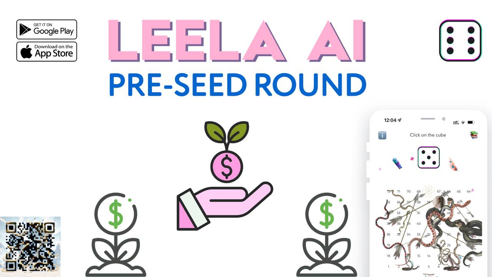

# Intro

---

## ॐ Namaste!

Have you ever thought that you can invest in business and at the same time engage in spiritual development?

[Leela Ai](https://tome.app/999-00e/leela-ai-en-clo8c6dum00ujpo7arj9pe2xw) - combines a board game from ancient times of India and its online version in a mobile application. In it, `ChatGPT` acts as a guru leading the player to liberation, which is the goal of the game [Leela Ai](https://tome.app/999-00e/leela-ai-en-clo8c6dum00ujpo7arj9pe2xw).

The MVP application has already brought more than $4,000 in sales.

Leela is a spiritual token that is used in the [Leela Ai game](https://tome.app/999-00e/leela-ai-en-clo8c6dum00ujpo7arj9pe2xw) application.

## [Presentation of the Leela Ai application](https://tome.app/999-00e/leela-ai-en-clo8c6dum00ujpo7arj9pe2xw)

### [Leela $LEELA tokenomics](https://docs.google.com/spreadsheets/d/1aqujAZzMqKcNpT9ZzjedIOyHJzBecmnCkMpNeg6dsFk)

The project is interested in a syndicate of angels from India, headed by [Arijit Bhattacharyya](https://www.linkedin.com/posts/raoffonom_gamingcommunity-spirituality-virtualreality-activity-7133036166295035904-KUiL?), who is currently the mentor of the project.

```
➡️ Soft Cap - 333 BNB
➡️ Hard Cap - 666 BNB
```

```
Minimum entry: 0.5 BNB
Maximum input: 222 BNB
```

🪙 720,000 $LEELA tokens from the PRE-SEED round go to investors of this round and the location to participate in the SEED round

⏰ from December 22-31 at 12:00 UTC on [PinkSale](https://www.pinksale.finance/private-sale/0xa6d61322173C9F3bAD9C1E4D8F912a2989B76086/1?chain=BSC)


