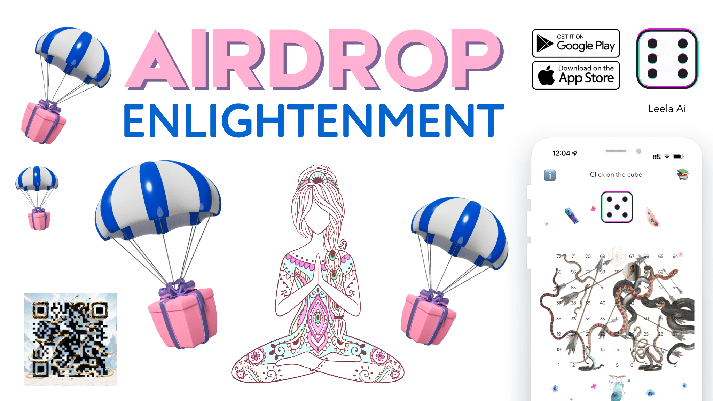
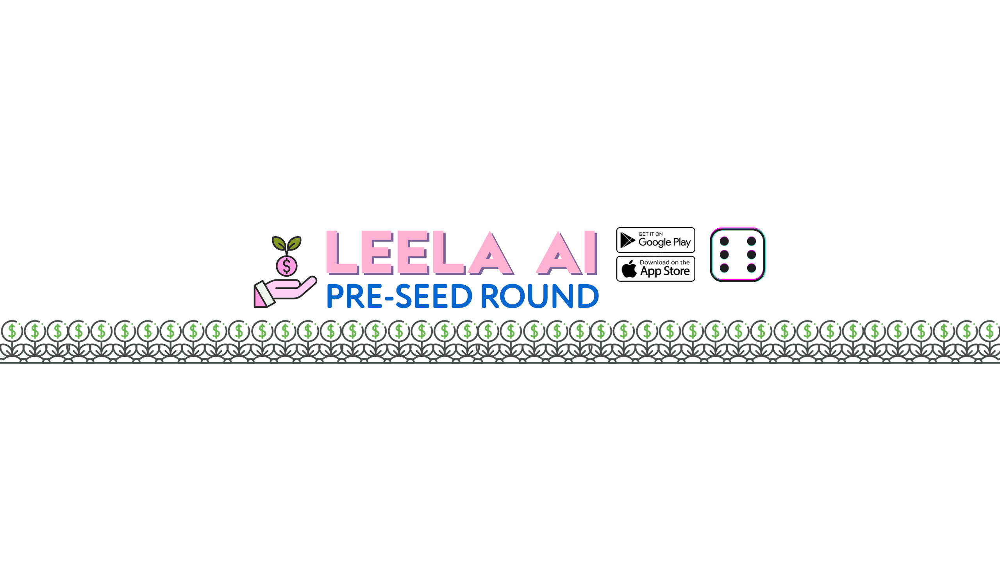

# LEELA AI ($LEELA)

---

**Leela Ai ($LEELA)** is a utility **token** that is used in the **Leela Ai** gaming application.
The application automatically deducts **1 $LEELA** from the user's balance with each move made in the game.
**$LEELA** can be purchased on the exchange or exchanged for other cryptocurrencies.
This **$LEELA** usage model encourages players to **purchase** and use the **token** within the gaming ecosystem to participate in the game. This could also create additional value for the token itself, as its demand will depend on player activity on the **Leela Ai** app.

<MDXLayout>

</MDXLayout>

## Tokenomics

[Link to document](https://docs.google.com/spreadsheets/d/1aqujAZzMqKcNpT9ZzjedIOyHJzBecmnCkMpNeg6dsFk)

| Public Sale Price        |                                                                   |              | TOTAL SUPPLY          |                 | Valuation   | $6 480 000,00 | Days a LCO    |
| ------------------------ | ----------------------------------------------------------------- | ------------ | --------------------- | --------------- | ----------- | ------------- | ------------- |
| Description of Token Use | Description / vesting                                             | Total Supply | Percent of Tot supply | Price per token | Valuation   | Collected USD | Total Percent |
| Pre-Seed Round           | 4% Unlock at LCO, 3 Months Cliff, then 14 months Linear vesting   | 720 000      | 10,00%                | $0,19           | $1 368 000  | $136 800      | 100%          |
| Seed Round               | 6% Unlock at LCO, 3 Months Cliff, then 14 months Linear vesting   | 720 000      | 10,00%                | $0,30           | $2 160 000  | $216 000      | 100%          |
| KOL Round                | 12% Unlock at LCO, 1 Months Cliff, then 12 months Linear vesting  | 360 000      | 5,00%                 | $0,60           | $4 320 000  | $216 000      | 100%          |
| Public Round (IDO)       | 20% Unlock at LCO, 1 Month Cliff, then 4 months Linear vesting    | 720 000      | 10,00%                | $0,90           | $6 480 000  | $648 000      | 100%          |
| Team                     | 0% Unlock at LCO, 12 Months Cliff, then 48 months monthly vesting | 720 000      | 10,00%                |                 |             |               | 100%          |
| Reserves                 | 0% Unlock at LCO, 12 Months Cliff, then 48 months monthly vesting | 720 000      | 10,00%                |                 |             |               | 100%          |
| Advisors                 | 0% Unlock at LCO, 6 Months Cliff, then 36 months monthly vesting  | 648 000      | 9,00%                 |                 |             |               | 100%          |
| Marketing                | 0% Unlock at LCO, 1 Month Cliff, then 36 months monthly vesting   | 720 000      | 10,00%                |                 |             |               | 100%          |
| Liquidity Fund           | 10% Unlock at LCO, No Cliff, then 16 months monthly vesting       | 720 000      | 10,00%                |                 |             |               | 100%          |
| Airdrop                  | 10% Unlock at LCO, No Cliff, then 16 months monthly vesting       | 720 000      | 10,00%                |                 |             |               | 100%          |
| Founders                 | 4% Unlock at LCO, 4 Months Cliff, then 48 months monthly vesting  | 432 000      | 6,00%                 |                 |             |               | 100%          |
| Total                    |                                                                   | 7 200 000    | 100,00                |                 | $14 328 000 | $1 216 800    |               |

## Token cost for different rounds:

1.  **Pre-Seed Round:**

- Price: `$0.19` per token.
- Goal: Attracting initial capital and preparing the project for subsequent stages of development.

2. **Seed Round:**

- Price: `$0.3` per token.
- Goal: Attracting major investors and supporting the project at the initial stage.

3. **Key Opinion Leaders (KOL Round):**

- Price: `$0.6` per token.
- Goal: KOLs can use their influence to draw attention to the project and increase its visibility among potential investors and clients. KOLs can use their influence to draw attention to a project and increase its visibility among potential investors and clients.

4. **Public Round (IDO):**

- Price: `$0.9` per token.
- Goal: Providing an opportunity for a wide audience to invest in the project token.

## Marketing

Everything new is well forgotten old. Nowadays, few people know about the game. We want to **spread the word about the game** through influencers and make it popular

## Compitition

There are a number of competitive players in the self-development and personal growth market:

**Trainings and Seminars**: Offline and online trainings conducted by experts in the field of self-development are also competitors.

**Educational Platforms**: Online platforms like Coursera and Udemy provide educational courses on personal growth and development.

**Psychology Apps**: Apps such as BetterHelp and Talkspace offer online consultations with psychologists and psychotherapists.

**Meditation and Relaxation Apps**: Platforms such as Headspace and Calm provide content for meditation, stress relief and well-being.

**Physical Health Apps**: Some apps focus on physical health, which affects personal growth.

**Books and Podcasts**: Self-help literature and audio content also provide alternative ways to learn.

**Online Coaching**: Online coaches and consultants provide personalized guidance.

**Leela stands out for its innovative Leela Ai technology and personalized content that provide a unique self-development experience.**

## Ambassador program

**Spiritual Tokens ($LEELA)**: Users receive Leela spiritual tokens as a reward for accumulated experience. The amount of **$LEELA** received from an enlightenment airdrop may depend on the user's achievement level or other factors.

**XP (Experience)**: Users can earn XP by completing **quests**. Each completed quest earns a certain **amount** of **XP**. The amount of **XP** affects the number of tokens received during the **Airdrop Enlightenment**

[Ambassador Program Page](https://zealy.io/c/leelaai/questboard)

## Road map

**Q1. 2024**

- Marketing. Interaction with influencers, traffic, ambassador program
- UI/UX redesign, development of 3D avatar and AI assistant
- Blockchain migration, redevelopment
- Web 3 mobile application and website
- Launch of the Leela Ai token

## Team

### Gaia Kamskaia - CEO

**She** firmly connects his life with the path of **liberation and enlightenment**.
**Jnana** yoga teacher, **Leela game** guide and founder of the Leela Ai mobile application.
**Since 2005**, Gaya has been practicing many types of yoga, united by one goal - physical health and peace of mind, continuing her eightfold path of Raja Yoga, conducting **Game Leela** for **10 years** around the world.

<MDXLayout>

</MDXLayout>

### Dmitrii Vasiliev - CTO

First author of the **React Native** course in RuNet. Creator of the **AWS Amplify** course, the first Russian participant in **AWS Community Builders**. Extensive technical skills: React Native, Apollo, Redux, GraphQL, and project management experience. Experience in creating MVPs, including prototyping and getting to market in the shortest possible time. Successful management of a variety of **IT projects, including games, education** and **mobile** applications for **finance**.

[Detailed summary](https://docs.google.com/document/d/1ANWruZpVRXQvsQkBljkYcRHZCRkt27ABBSMS_FXQSJ0/edit)

<MDXLayout>

</MDXLayout>

### Mentor - Arijit Bhattacharyya

**Arijit Bhattacharyya** is a seasoned entrepreneur with a remarkable career spanning two decades. He founded **Virtualinfocom**, one of the pioneering **Game & VR** development companies in India, at the **age of 17** in **1998**. A record holder in both technology and finance, **Arijit** has produced over **300 games** and VR/AR experiences. A mentor to over **700 developers** worldwide, he has also assisted **6,000** startups globally. Arijit's expertise covers international business development, fundraising, innovation, and market entry, with a focus on **AI, blockchain,** and **deeptech**. He is a **TEDx speaker**, a consultant for the Asian Development Bank, and a jury member for the **National Startup Award** by the **Government of India**. Arijit is an influential figure in various domains, including **VR, AI, blockchain, and Industry 4.0**.

[Detailed summary](https://www.linkedin.com/in/arijitbhattacharyya/)

<MDXLayout>

</MDXLayout>

## Offer for investors

Our potential audience is **300 million people** interested in self-knowledge and yoga.
We offer you a unique opportunity to invest in our project and make money on it.
You can buy a token now from **Pre-Seed Round**

⏰  December 22-31 at 12:00 UTC on [PinkSale](https://www.pinksale.finance/private-sale/0xa6d61322173C9F3bAD9C1E4D8F912a2989B76086/1?chain=BSC)

<MDXLayout>

</MDXLayout>

## Contact

<table>
  <tr>
    <td align="center">
      <a href="">
        
         
        <b>Kamskaia Gaia</b>
      </a>
       
      <a href="#content-playom" title="Content">🖋 TG/IG: playom</a>
    </td>
    <td align="center">
      
    </td>
  </tr>
</table>
